# Flipnic file tools GUI

This document outlines the basics of using the GUI version of Flipnic File Tools.

## Table of contents

- [Supported formats](#supported-formats)
- [Getting the correct version](#getting-the-correct-version)
- [FFmpeg detection](#ffmpeg-detection)
- [User interface basics](#user-interface-basics)
- [Files tab](#files-tab)
- [Convert tab](#convert-tab)
- [Messages tab](#messages-tab)
- [Sound player](#sound-player)
- [Texture tab](#texture-tab)
- [Models tab](#models-tab)
- [Camera sequences tab](#camera-sequences-tab)
- [Menu mockup tab](#menu-mockup-tab)
- [Hitboxes tab](#hitboxes-tab)
- [Samples tab](#samples-tab)
- [Save file tab](#save-file-tab)
- [Gimmicks tab](#gimmicks-tab)
- [Event script tab](#event-script-tab)

## Supported formats

The GUI version can open the following formats:

* BD - Voicebank body
* BIN - Blob files
* COL - Collision maps
* CSV - Comma Separated Values
* FPC - Camera Sequences
* FPD - Fixed Path Data
* HD - Voicebank headers
* ICO - PlayStation 2 save icon (single frame non-animated, RLE compressed texture)
* IPU - PlayStation 2 MPEG-2 video stream
* ISO - UDF disc images
* LAY - Stage layouts
* LIT - Light maps
* LP4 - 3D models/resources
* MID - Standard MIDI file
* MLB - Menu file
* MSG - Message table
* PSS - Interleaved audio/video streams
* SST - Stage metadata and script files
* SVAG/INT - Compressed Sony ADPCM audio
* TM2 - PlayStation 2 texture files
* TXT - Plain text
* VSD - Vibration strength data
* XML - Extensible Markup Language files

## Getting the correct version

You can get the latest binary from the [GitHub releases](https://github.com/MarkusMaal/FlipnicFileTools/releases) page. Select a file that matches your operating system. Please note that GUI version is UNSUPPORTED if you have Linux on ARM64. CPU architecture of a Linux system can be quickly identified by running the `uname -m` command.

macOS can be easily identified by the Apple logo at the top left of the screen. If your device has that, click on it and choose "About this Mac". You should see a window that looks something like this:

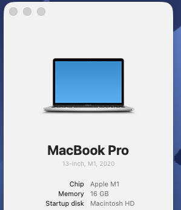

If the chip says Apple M and then a number, you want to run the Apple Silicon version, otherwise you want the Intel version.

Windows can be identified if you press Windows+Pause/Break (usually it's a combo key, you may seldom have just a "Pause" key instead). It should open a window with information like this:

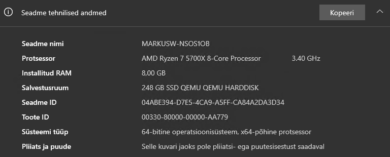

Check "System type". If it says 64-bit operating system, x64-based processor, you want the x64 version of the program.

If it says "ARM based processor" and "64-bit operating system" you want the arm64 version. If it says "32-bit operating system" and either "x64-based processor" or "x86-based processor" you want the x86 version of the program.

If it says "ARM based processor" and "32-bit operating system", your device is unsupported by this program.

## FFmpeg detection

When you launch the FlipnicFileToolGUI executable, you should see a window with text like this:

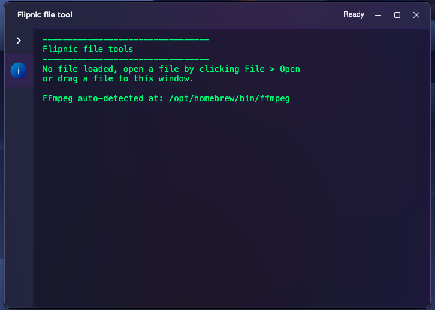

If the program is successfully able to auto-detect where FFmpeg is installed, it'll tell you where it's found on your system. FFmpeg is required for video conversion operations (mainly for PSS files).

If it's not auto-detected, the program will prompt you for an FFmpeg executable when it's needed.

## User interface basics

By default, the program starts in dark mode. If you want a light theme instead, from the menu bar select "Options > Toggle dark theme". Here's what that looks like:

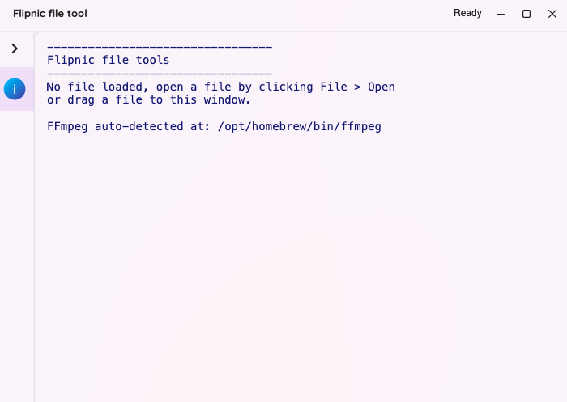

There are 2 ways to open a file:

* Menu bar > File > Open
* Drag and drop a file to the window (Windows/Mac only)

When you open a file, the program switches its interface to match with the requirements for the specific file format. For example, if we open a NATURE_0.HD file, the interface will look like this:

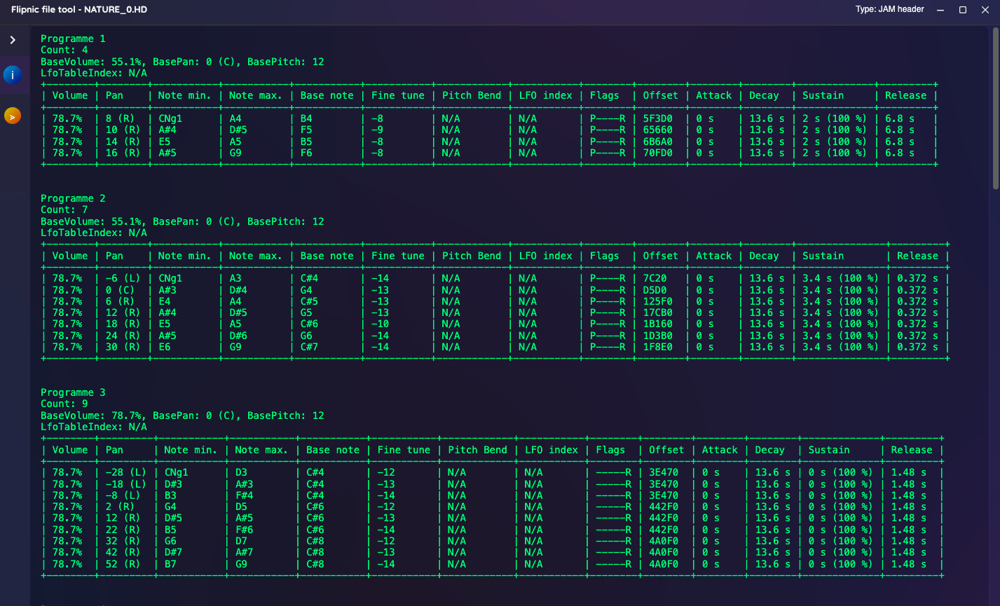

On the left side, you'll see tabs for various operations that can be performed with this file. You may click the arrow to expand the side panel, which will reveal which operations can be performed on that tab.

Most formats will have the info tab, which displays general information about the file, basically equivalent to the --show flags in the CLI version.

On the top right, you'll see a description of the file format (in this case: JAM header).

On the top left, you'll see the name of the program and the name of the currently opened file.

The program also supports multiple windows. To open a window in non-Mac systems, go to Menu bar > File > New window. For Mac systems, you instead have to click Menu bar > Flipnic file tool > New window.

Pressing X or Cmd+W on a Mac will close the current window, but it will not close the program. To completely close the program, you need to press either Cmd+Q or click Menu bar > Flipnic file tool > Quit.

## Files tab

If you open a .ISO or .BIN file, you'll see the file browser. The files are sorted as they appear in TOC and not necessarily in alphabetical order.

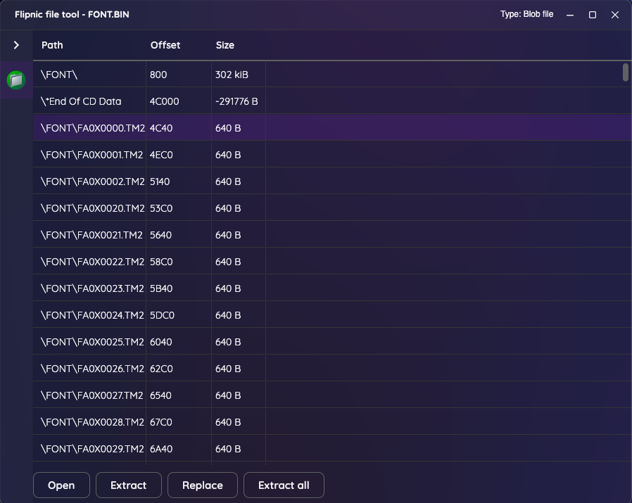

Clicking on a file will allow you to perform Open/Extract/Replace operations. Here's what the buttons do:

* Open - Attempts to open the file directly without extracting it. However, it is strongly recommended to extract all the files before attempting this, since the program may sometimes use other files and that's only possible if you extract everything.
* Extract - Extracts the selected file to a destination location specified.
* Replace - Allows you to replace the file in the container (basically repacking, smaller or equal sized files are recommended for most stability).
* Extract all - Extracts every file from the container to a destination location specified.

## Convert tab

For music-related .HD files and .PSS files, there will be a convert tab. This allows you to convert this file to a more common file format.

For .HD files, you may have to specify the path to matching MID and BD files for the conversion process to work.

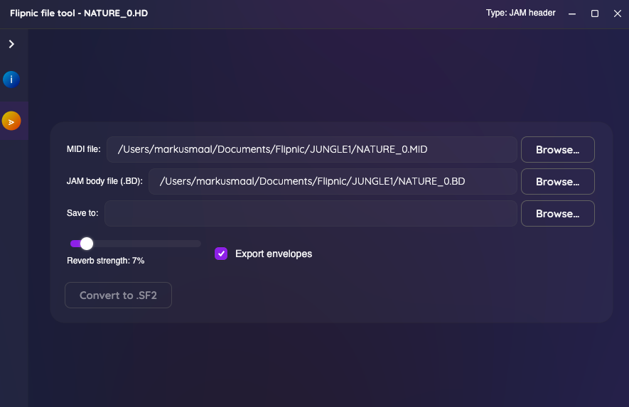

For .PSS files, you may have to specify the FFmpeg path (if it wasn't auto-detected). If you are using files from the PAL version of the game, you also need to check the "Use PAL instead of NTSC".

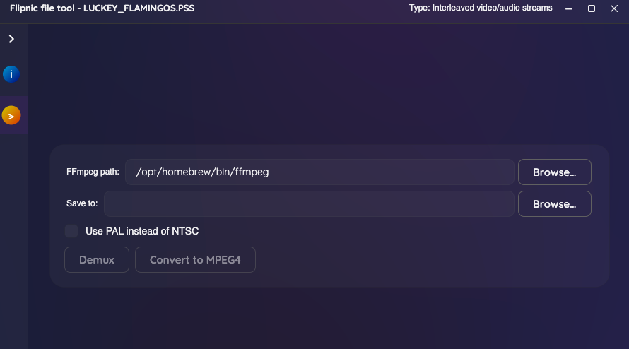

In any case, you need to provide the destination folder location and click a button to perform the desired conversion operation.

## Messages tab

When you open the JA.MSG file, the interface will look like this:

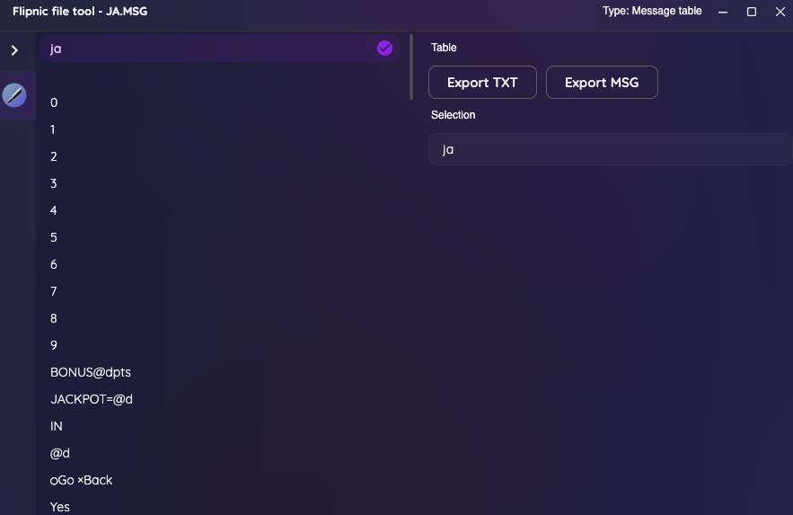

On the left you can see a list of messages stored within the file. Click on any of them allows you to edit the values.

After you've done or haven't done the modifications, you can click one of the export buttons. Here's what they do:

* Export TXT - Saves the message table as a plain text file where each entry is separated by new line characters
* Export MSG - Saves the message table as a .MSG file that can be read parsed by the game

## Sound player

When you open .SVAG or .INT file, you can either play the sound immediately or convert and save it.

While the audio is playing from the program, it's not possible to stop it.

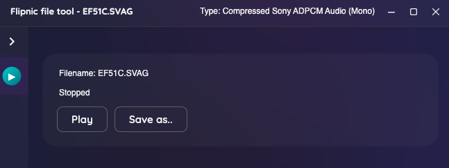

## Texture tab

When opening a .TM2 or .LP4 file, the texture tab may be visible. This tab allows you to preview the texture as an image and also to save it as a .PNG file.

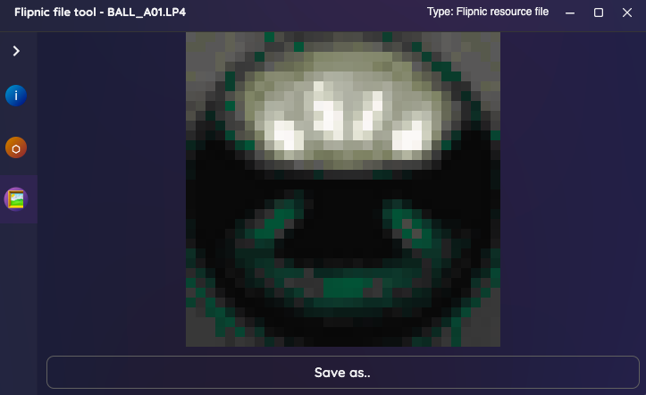

## Models tab

This tab allows you to see 3D models associate with this file.

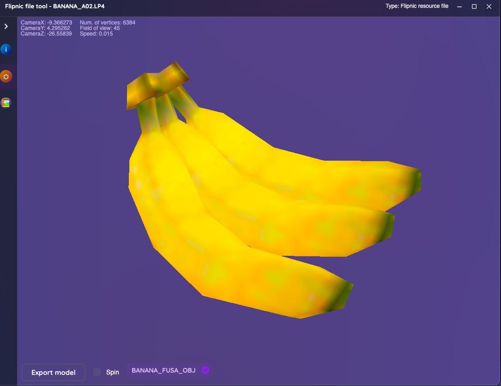

To move around, use WASD keys. Hold Space/Shift to mode up/down. Drag with a mouse button to look around. Hold the CTRL key to move faster. To see more keybinds press F1.

Export model button allows you to save the current model as a Wavefront OBJ file with the texture set as the material.

Checking "Spin" makes the model spin until you untick it.

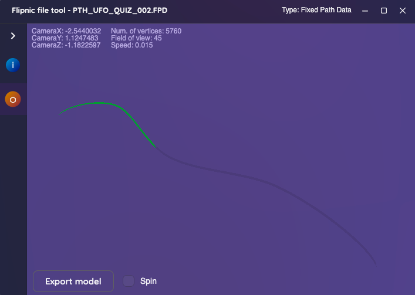

When you open a .PTH file you will see a shape the resembles a path stored in the file. As the path is followed, the shape eventually fills with green and once the end is reached, it repeats the path. You can press I to freeze the path and U to resume it.

## Camera sequences tab

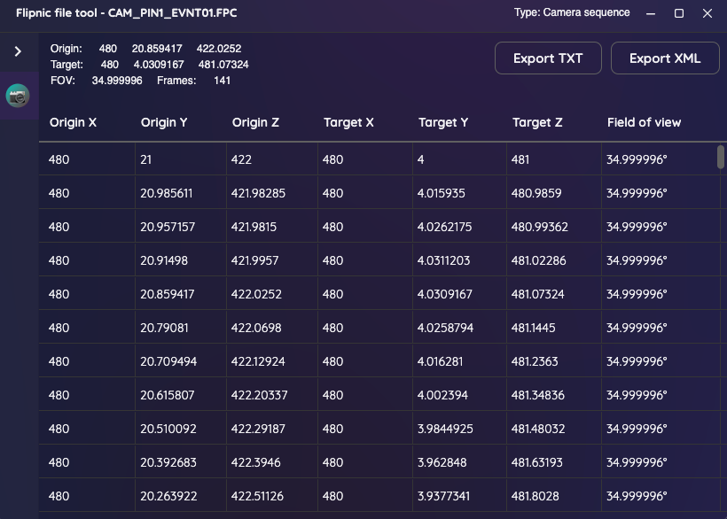

When opening a .FPC file, you will enter the camera sequences tab. In Flipnic, a camera position consists of 2 points in a 3D space - the origin and target. Origin is the actual position of camera and target is an imaginary point where the camera is looking at. There's also a field of view attribute, where higher values make you see more at once and lower values make you see less at once (a sort of distorted zoom in/zoom out).

The root position can be seen at the top left. If the camera sequence is animated, you'll see a table at the bottom with values for every frame of the animation. If the animation table is empty, the root position is used.

Flipnic file tools allows you to save the camera sequence as either a TXT file or XML file. The TXT file will basically have the same info as opening the file from the CLI version.

## Menu mockup tab

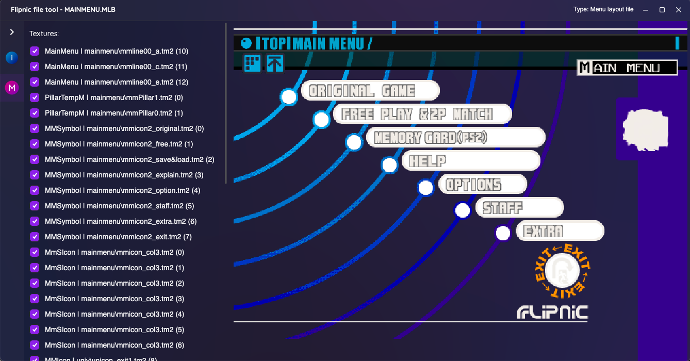

When you open a .MLB file, you'll see a mockup of the menu on this tab. In a mockup, every menu element is visible by default. If you want to hide certain things, you can uncheck the various checkboxes on the left.

To save the mockup as a PNG, right click on it and select "Save as..."

## Hitboxes tab

When opening a .COL file, you can convert the hitboxes into Waveform OBJ files.

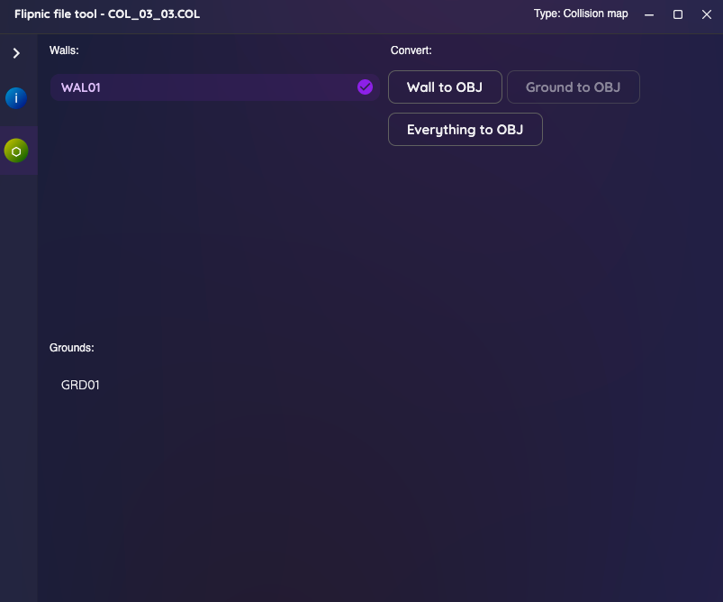

The .COL files have wall hitboxes and ground hitboxes. You may select any of them from the left.

Here's what the buttons do:

* Wall to OBJ - converts the selected wall to a Wavefront OBJ file
* Ground to OBJ - same as Wall to OBJ, but for the selected ground
* Everything to OBJ - combines everything and allows you to convert that into Wavefront OBJ file

## Samples tab

Opening a .BD file allows you to extract the raw samples from it. Not very unique, basically PSound functionality, but this program does show the offsets to the user.

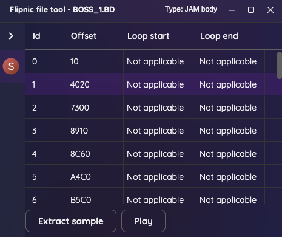

## Save file tab

The DEFSAVE.SST file contains the default rankings data. This tab allows you to view it.

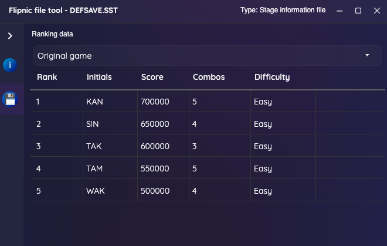

## Gimmicks tab

Stages have interactable objects that are internally referred to as gimmicks. This tab allows you to view information about each gimmick.

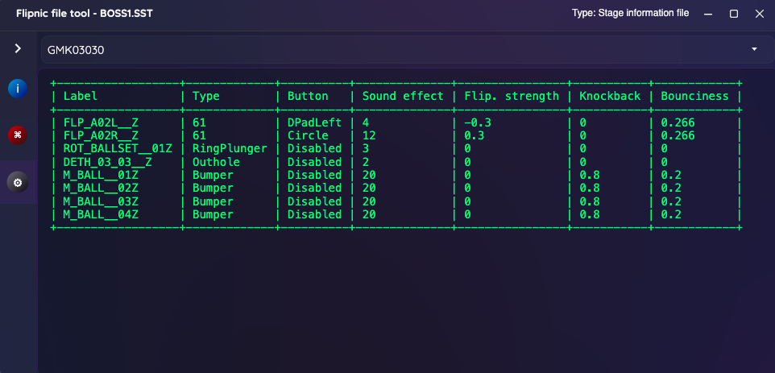

This information includes the following:

* Label - For referencing this gimmick (must match labels in .LAY files)
* Type - Tries to determine what type of gimmick this is (displays a number if unknown)
* Button - Which button changes the state of this gimmick
* Sound effect - Which sound effect plays when a ball hits this gimmick
* Flipper strength - The angle multiplier at which the flipper stops rotating when the flipper button is held down
* Knockback - If this value is higher than 0, the ball will bounce back when hitting this gimmick (usually for bumpers)
* Bounciness - How strongly the ball bounces off this object when falling on it

You can switch between gimmick areas using the top dropdown menu.

## Event script tab

For stage-related SST files, there is an event script. This program **tries** to turn it into human-readable pseudocode.

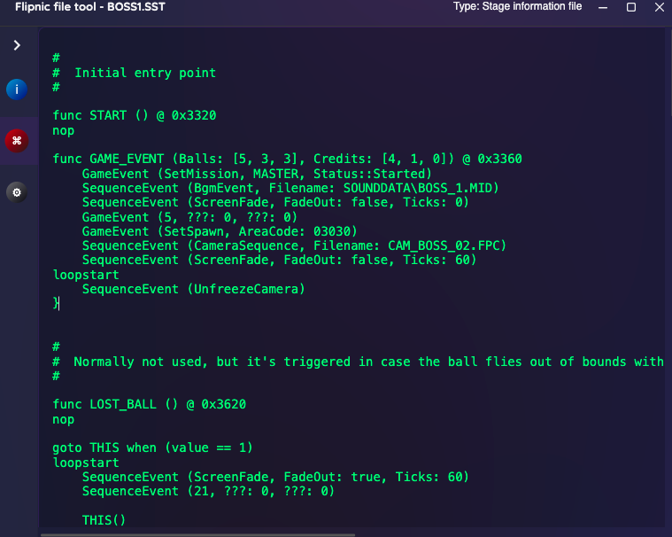

For best results, you should first load a JA.MSG file to memory before opening the .SST file. This can be done from Menu bar > Options > Import JA.MSG. If you didn't do this, the program will display a warning.