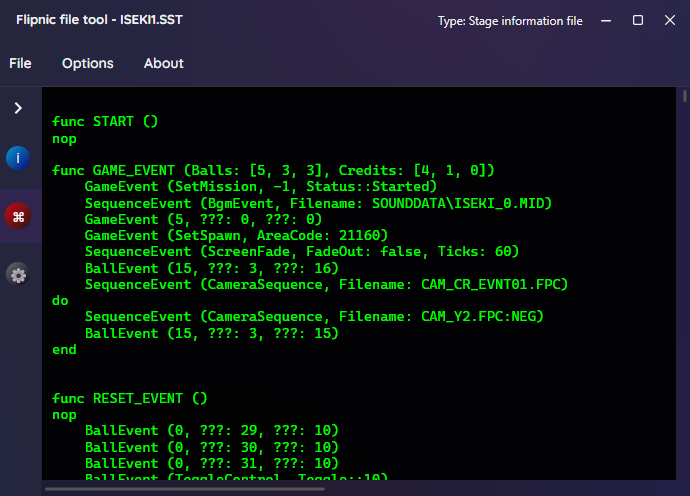

# Flipnic file tools

Several command line tools with a GUI front-end for various file formats used by Flipnic.

Build instructions: [BUILD.md](BUILD.md)

Prerequisites:

* [FFmpeg](https://ffmpeg.org/) - required for some video related operations
* [ImageMagick](https://imagemagick.org/) - required for creating BMP mock-ups from menu files (when using the CLI version)

## GUI version

There's also a graphical front-end for this CLI tool, which is easier to use, but also gives you better preview for stuff like textures, audio samples, stuff like that without having to type down a bunch of commands with the disadvantages being lack of automation options and in some cases compatibility.



## Command line syntax

To see command line syntax at any time, you can run: `FlipnicFileTool --help`

## Blob files (*.BIN)

These are big files that contain smaller files within themselves (basically like an uncompressesed .ZIP or .TAR file, but proprietary to Flipnic).

Listing files: `FlipnicFileTool --list-files --input TUTO.BIN`

Outputs: 
```
+-----------------+-----------------+-----------------+
| Path            | Offset          | Size            | 
+-----------------+-----------------+-----------------+
| \CHAP01.PSS     | 0x800           | 203.13 MiB      | 
| \CHAP02.PSS     | 0xCB22000       | 235.73 MiB      | 
| \CHAP03.PSS     | 0x1B6DE000      | 247.46 MiB      | 
| \CHAP04.PSS     | 0x2AE54800      | 162.96 MiB      | 
| \CHAP05.PSS     | 0x35149800      | 315.28 MiB      | 
| \CHAP06.PSS     | 0x48C91000      | 212.51 MiB      | 
| \CHAP07.PSS     | 0x56113800      | 128.83 MiB      | 
+-----------------+-----------------+-----------------+
```

Extract files: `FlipnicFileTool --extract-files --input RES.BIN --output ./RES`

## Movies (*.PSS)

These are not a standard PlayStation video streams, instead they're a special container format in Flipnic, which contain audio and video streams.

If you want to convert a PSS file directly into a MOV file (requires FFmpeg): `FlipnicFileTool --convert-pss-mov --input ./FREEZE_OVER.PSS --output ./FREEZE_OVER.MOV` (this will also integrate multiple audio streams into the output file if the .PSS file has multiple audio streams)

If you have the PAL version, you should also add a --pal flag: `FlipnicFileTool --convert-pss-mov --input ./FREEZE_OVER.PSS --output ./FREEZE_OVER.MOV --pal`

If you just want to see what streams a .PSS file contains, run this: `FlipnicFileTool SHUKYAKUDEMO.PSS --list-pss-streams`

Outputs:
``` 
+-----------------+-----------------+
| Stream          | Size            | 
+-----------------+-----------------+
| Audio 1         | 4.09 MiB        | 
| Audio 2         | 4.09 MiB        | 
| Audio 3         | 4.09 MiB        | 
| Audio 4         | 4.09 MiB        | 
| Audio 5         | 4.09 MiB        | 
| Video           | 101.48 MiB      | 
+-----------------+-----------------+
```

If you just want to separate streams and not convert any of the files: `FlipnicFileTool --extract-pss-streams --input ./FREEZE_OVER.PSS --output .`

## Sound files (*.INT / *.SVAG)

The difference between the two is that .INT is stereo and .SVAG is mono.

Convert .SVAG file to .WAV: `FlipnicFileTool --convert-svag --input MSG_001.SVAG --output MSG_001.WAV`

Convert .INT file to .WAV: `FlipnicFileTool --convert-int --input FREEZE_OVER.1.INT --output FREEZE_OVER.WAV`

## Texture files (*.TM2)

To view information about a texture file: `FlipnicFileTool --show-tim2 --input FLOWER_TUTUJI0.TM2`

Outputs:
```
TIM2 texture file

Name: FLOWER_TUTUJI0.TM2
Width: 16
Height: 16
Colors: 1024
Palette type: 8 bpp

Palette:
+-----------+-----------+-----------+
| ID        | RGB       | Alpha     | 
+-----------+-----------+-----------+
| 0x00      | #000000   | 0         | 
| 0x01      | #092813   | 180       | 
| 0x02      | #0C2710   | 209       | 
| 0x03      | #0F2E14   | 168       | 
| 0x04      | #123216   | 132       | 
| 0x05      | #133518   | 120       | 
| 0x06      | #173C1C   | 74        | 
| 0x07      | #183C1A   | 121       | 
| 0x08      | #1A421F   | 29        | 
| 0x09      | #194421   | 2         | 
...
```

To convert a texture file into a BMP file: `FlipnicFileTool --convert-tim2 --input FLOWER_TUTUJI0.TM2 --output FLOWER_TUTUJI0.BMP`

To ignore the palette and use a generic grayscale palette: `FlipnicFileTool --convert-tim2 --input FLOWER_TUTUJI0.TM2 --output FLOWER_TUTUJI0_GRAYSCALE.BMP --grayscale`

## Menu files (*.MLB)

To view various sections used by a menu file: `FlipnicFileTool --show-mlb --input BG01_A0.MLB`

Outputs:

```
+--------------------+--------------------+--------------------+--------------------+--------------------+
| Section            | Index              | Texture            | Position           | Dimensions         | 
+--------------------+--------------------+--------------------+--------------------+--------------------+
| bg1_A0             | 0                  | Bg\A0\bg1_00a.tm2  | 0x0                | 512x256            | 
| bg1_A0             | 1                  | Bg\A0\bg1_00b.tm2  | 512x0              | 128x256            | 
| bg1_A0             | 2                  | Bg\A0\bg1_00c.tm2  | 0x256              | 512x128            | 
| bg1_A0             | 3                  | Bg\A0\bg1_00d.tm2  | 512x256            | 128x128            | 
| bg1_A0             | 4                  | Bg\A0\bg1_00e.tm2  | 0x384              | 512x64             | 
| bg1_A0             | 5                  | Bg\A0\bg1_00f.tm2  | 512x384            | 128x64             | 
| bg0_A0             | 0                  | Bg\A0\bg0_00a.tm2  | 0x0                | 512x256            | 
| bg0_A0             | 1                  | Bg\A0\bg0_00b.tm2  | 512x0              | 128x256            | 
| bg0_A0             | 2                  | Bg\A0\bg0_00c.tm2  | 0x256              | 512x128            | 
| bg0_A0             | 3                  | Bg\A0\bg0_00d.tm2  | 512x256            | 128x128            | 
| bg0_A0             | 4                  | Bg\A0\bg0_00e.tm2  | 0x384              | 512x64             | 
| bg0_A0             | 5                  | Bg\A0\bg0_00f.tm2  | 512x384            | 128x64             | 
| bg0_A0             | 6                  | Bg\A0\bg0_00a.tm2  | 640x0              | 512x256            | 
| bg0_A0             | 7                  | Bg\A0\bg0_00b.tm2  | 1152x0             | 128x256            | 
| bg0_A0             | 8                  | Bg\A0\bg0_00c.tm2  | 640x256            | 512x128            | 
| bg0_A0             | 9                  | Bg\A0\bg0_00d.tm2  | 1152x256           | 128x128            | 
| bg0_A0             | 10                 | Bg\A0\bg0_00e.tm2  | 640x384            | 512x64             | 
| bg0_A0             | 11                 | Bg\A0\bg0_00f.tm2  | 1152x384           | 128x64             | 
+--------------------+--------------------+--------------------+--------------------+--------------------+
```

To create a mock-up of the menu as a .BMP file: `FlipnicFileTool --generate-mockup --input MAINMENU.MLB --output MAINMENU.BMP`

You can also only include a specific section from the menu file mockup: `FlipnicFileTool --generate-mockup --input MAINMENU.MLB --output MAINMENU.BMP --mlb-section MainMenu`

## Camera sequences (*.FPC)

These files contain information about the camera and optionally can have keyframes to create an animated camera sequence.

Example:

`FlipnicFileTool --input CAM_Y3_EVNT01.FPC --show-fpc`

Outputs:

```
Frames: 140, Sequences: 6
Field of view: 34.999996
Origin:  (824.95325; 25.8749; 771.5084)
Target:  (850.5004; 1.8749; 771.5004)

+-----------------+-----------------+-----------------+-----------------+-----------------+-----------------+-----------------+-----------------+
| Frame           | OriginX         | OriginY         | OriginZ         | TargetX         | TargetY         | TargetZ         | FOV             | 
+-----------------+-----------------+-----------------+-----------------+-----------------+-----------------+-----------------+-----------------+
| 1               | 797             | 29              | 759             | 838             | 5               | 759             | 34.999996       | 
| 2               | 797.0022        | 28.999382       | 759.0034        | 838.0025        | 4.999382        | 759.0025        | 34.999996       | 
| 3               | 797.00854       | 28.99754        | 759.0116        | 838.0098        | 4.9975395       | 759.0098        | 34.999996       | 
| 4               | 797.0194        | 28.994492       | 759.02466       | 838.02203       | 4.9944906       | 759.02203       | 34.999996       | 

...

| 139             | 840.9867        | 25.000618       | 774.9975        | 853.9975        | 1.0006182       | 774.9975        | 34.999996       | 
| 140             | 841             | 25              | 775             | 854             | 1               | 775             | 34.999996       | 
+-----------------+-----------------+-----------------+-----------------+-----------------+-----------------+-----------------+-----------------+
```

## Stage information files (*.SST)

These files store various things, stuff like game events, list of filenames, gimmicks, etc.

Example:
`FlipnicFileTool --input ISEKI1.SST --show-sst-toc`

Outputs:
```
+-----------------+-----------------+-----------------+-----------------+
| Name            | Offset          | Entry count     | Entry size      | 
+-----------------+-----------------+-----------------+-----------------+
| BALLN           | 0x3C0           | 3               | 0x40            | 
| SKYN            | 0x480           | 1               | 0x20            | 
| CAMN            | 0x4A0           | 43              | 0x20            | 
| CAMD            | 0xA00           | 25              | 0x30            | 
| CAMLD           | 0xEB0           | 25              | 0x28            | 
| CAMID           | 0x12A0          | 0               | 0x70            | 
| LIGHTN          | 0x12A0          | 1               | 0x20            | 
| PATHN           | 0x12C0          | 265             | 0x20            | 

...

| GMK18180        | 0x35DD0         | 0               | 0x80            | 
| REBIRTH_        | 0x35DD0         | 24              | 0x8             | 
| FLIESFPB        | 0x35E90         | 1               | 0xDA0           | 
+-----------------+-----------------+-----------------+-----------------+
```

You can also see the event script in human-readable format by running: `FlipnicFileTool --input ISEKI_1.SST --msg-path ../JA.MSG --get-pseudo-code`

Outputs:
```
func START ()                                                        @ 0x7B30
nop

func GAME_EVENT (Balls: [5, 3, 3], Credits: [4, 1, 0])               @ 0x7B70
        GameEvent (SetMission, MASTER, Status::Started)
        SequenceEvent (BgmEvent, Filename: SOUNDDATA\ISEKI_0.MID)
        GameEvent (5, ???: 0, ???: 0)
        GameEvent (SetSpawn, AreaCode: 21160)
        SequenceEvent (ScreenFade, FadeOut: false, Ticks: 60)
        BallEvent (15, ???: 3, ???: 16)
        SequenceEvent (CameraSequence, Filename: CAM_CR_EVNT01.FPC)
do
        SequenceEvent (CameraSequence, Filename: CAM_Y2.FPC:NEG)
        BallEvent (15, ???: 3, ???: 15)
end


func RESET_EVENT ()                 
...
```

## Message files (*.MSG)

These files store text strings, which may be referenced by IDs elsewhere (basically just that just helps save disc space).

Example:
`FlipnicFileTool --input JA.MSG --show-messages`

Outputs:
```
Magic: FpnMsg00
Entries: 92
+-------------------------+-------------------------+
| ID                      | Message                 | 
+-------------------------+-------------------------+
| 0                       | ja                      | 
| 1                       |                         | 
| 2                       | 0                       | 
| 3                       | 1                       | 
| 4                       | 2                       | 

...

| 90                      | 100 BLOCKS              | 
| 91                      | RED BLOCKS              | 
+-------------------------+-------------------------+
```

## Resource files (*.LP4)

These files define stuff like 3D models and 2D animation sequences (e.g. the WONDERFUL text when you complete a mission). Not much is known about this format, but you can still see some info about them.

Example: `FlipnicFileTool --input DIR_SEL.LP4 --show-lp4`

Outputs:
```
Type: 4
Model count: 2
Has embedded resources: Yes
Is 2D animation: No
```

## VAB header files (*.HD)

These files contain information about VAB soundbank file pairs (.HD/.BD), used mainly for background music, but sometimes also sound effects.

Example: `FlipnicFileTool --input NATURE_1.HD --show-hd`

Outputs:
```
Programme 1
Count: 2
BaseVolume: 63, Pan: 64
LfoTableIndex: 127
StartNoteRange: CNeg1, EndNoteRange: CNeg1
+-----------------+-----------------+-----------------+-----------------+-----------------+-----------------+-----------------+-----------------+-----------------+-----------------+-----------------+
| Volume          | Pan             | Note min.       | Note max.       | Base note       | Karaoke         | LFO table idx   | Reverb          | SD_VA_SSA       | SD_VP_ADSR1     | SD_VP_ADSR2     | 
+-----------------+-----------------+-----------------+-----------------+-----------------+-----------------+-----------------+-----------------+-----------------+-----------------+-----------------+
| 77              | 12              | CNeg1           | A4              | B4              | −8              | 129             | 70              | C980FF          | 4FAC            | 5A00            | 
| 79              | 12              | ASharp4         | G9              | F5              | −9              | 129             | 1               | D580FF          | 4FAC            | 5A00            | 
+-----------------+-----------------+-----------------+-----------------+-----------------+-----------------+-----------------+-----------------+-----------------+-----------------+-----------------+


...
```

## Layout files (*.LAY)

Determines where things are placed on the stage and how they are scaled/skewed.

Example: `FlipnicFileTool --input LAY_13_14.LAY --show-lay`

Outputs:
````
+--------------------------------------+--------------------------------------+--------------------------------------+--------------------------------------+
| Label                                | Size                                 | Skew                                 | Position                             | 
+--------------------------------------+--------------------------------------+--------------------------------------+--------------------------------------+
| LAY_13_14                            | 1/1/1                                | 0/0/0                                | 0/0/0                                |
| PIN1_BMP_SHADOW_                     | 1/1/1                                | 0/0/0                                | 480.3896/-3.5159056/522.5597         |
...
````


## FlipnicLib

If you want to work with Flipnic file formats on your own projects, you can add FlipnicLib as a dependancy to your project. Both the GUI and CLI of FlipnicFileTool are just front-ends to this library.